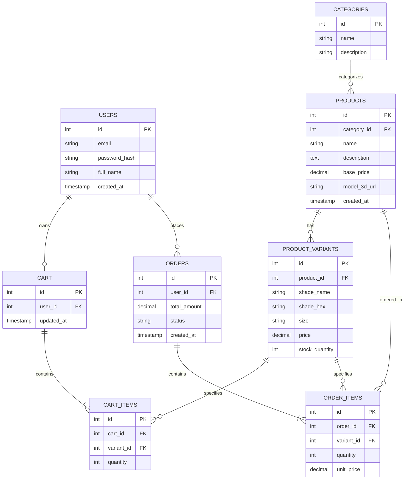

# Sprint 1: System Architecture & Scope Definition

## 1. Target Audience & Market Focus

- **Primary Persona:** Teenage and college-going girls (roughly ages 15–24) who follow beauty trends on social media, shop with a limited monthly budget, and want to experiment with makeup without overspending.
- **Core Pain Point:** Quality, trend-relevant makeup products are either too expensive or hard to find through affordable local sellers — buyers are forced to choose between overpriced imported brands and unreliable, unbranded local options.
- **Domain Scope:** Beauty & Personal Care — specifically color cosmetics (face, eyes, lips) targeted at a budget-conscious, trend-driven youth market, sold under the brand **Blushique**.

## 2. MVP Feature Scope

| Category | Feature Name | Description | Priority |
|---|---|---|---|
| Authentication | User Registration & Authentication | Password hashing and JWT-based authentication mechanism (handled via Supabase Auth). | High (MVP) |
| Catalog | Product List & Search | Product browsing with category, price-range, and shade filtering. | High (MVP) |
| Catalog | Shade/Size Variant Selection | Each product can have multiple shade and size variants with independent stock and price. | High (MVP) |
| Catalog | 3D Product Viewer | Interactive 3D preview of select products (e.g. rotating lipstick/palette model, shade swatch preview). | High (MVP) |
| Cart | Cart Management | State-persistent cart management (add, update quantity/variant, remove). | High (MVP) |
| Checkout | Order Processing | Mock payment gateway integration and order object instantiation. | High (MVP) |
| Admin | Inventory Control | Admin CRUD for products, categories, and variants. | Medium |

## 3. Tech Stack Selection & Justification

- **Frontend Framework:** React, with **react-three-fiber / Three.js** for 3D elements
  *Justification:* React's component model suits a catalog-heavy UI with reusable product cards and variant selectors, while `react-three-fiber` (a React renderer for Three.js) lets 3D elements — a rotating product hero, an interactive shade preview — be built as ordinary React components rather than a separate rendering pipeline, keeping the frontend codebase unified.

- **Backend Infrastructure:** Supabase (Postgres-backed Backend-as-a-Service)
  *Justification:* Supabase auto-generates a REST/GraphQL API directly from a relational Postgres schema and includes built-in authentication, removing the need to hand-write a full Express API layer solo within a semester, while still producing a real relational database that satisfies the ERD requirements below.

- **Database Management System:** PostgreSQL (via Supabase)
  *Justification:* Products in this domain have variant attributes (shade, size, per-variant stock) that map cleanly to a normalized relational schema with explicit primary/foreign keys — directly matching the ERD evaluation criteria (SQL data types, PK/FK identification, cardinality) rather than approximating them in a document store.

- **Caching & Asynchronous Processing (Optional):** Supabase Storage (for product/3D asset delivery) + browser-side caching of 3D model assets to avoid repeated downloads of the same 3D files across pages.

- **Hosting & Deployment:** Frontend deployed on **Vercel** (auto-deploys from GitHub on push); backend, database, and file storage hosted on **Supabase**, whose free tier covers this project's scope. This separation keeps the 3D-heavy frontend bundle independently deployable from the data layer.

## 4. Entity-Relationship Diagram (ERD)

**Cardinality summary:**
- Users 1:N Orders — a user can place many orders.
- Users 1:1 Cart — each user has one active cart.
- Cart 1:N Cart_Items — a cart holds many line items.
- Products 1:N Product_Variants — a product can have many shade/size variants.
- Products 1:1 (optional) 3D model asset — `model_3d_url` stores a reference to the product's 3D asset in Supabase Storage.
- Orders 1:N Order_Items — an order contains many line items.
- Product_Variants 1:N Order_Items / Cart_Items — a variant can appear in many orders/carts (N:M between Products and Orders resolved through Order_Items).
- Categories 1:N Products — a category groups many products.
