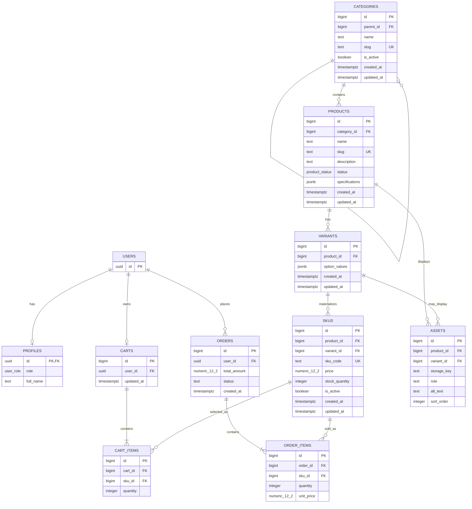

# Sprint 2: Catalog Data Foundation

## Table of Contents

1. [Sprint goal and scope boundary](#1-sprint-goal-and-scope-boundary)
2. [Sprint 1 decisions reused or changed](#2-sprint-1-decisions-reused-or-changed)
3. [Updated ERD and data dictionary](#3-updated-erd-and-data-dictionary)
4. [Administration route table with examples](#4-administration-route-table-with-examples)
5. [Data integrity and authorization decisions](#5-data-integrity-and-authorization-decisions)
6. [Seed data and demonstration](#6-seed-data-and-demonstration-instructions)
7. [Test strategy, command, and result](#7-test-strategy-command-and-result)
8. [Known limitations and Sprint 3 backlog](#8-known-limitations-and-sprint-3-backlog)

---

## 1. Sprint goal and scope boundary

### Goal

Sprint 2 turns the Sprint 1 Blushique architecture into a reliable catalog database foundation. The implementation persists categories, products, variants and sellable SKUs while protecting identity, relationships, price and stock.

### In scope

- Category tree management with stable IDs, unique slugs and active status.
- Product creation/editing with name, slug, description, status and canonical category.
- Variant records containing option values.
- SKU records containing unique SKU code, price, stock and active status.
- Authenticated administrator routes.
- PostgreSQL constraints, migrations, seed data and automated tests.

### Explicitly out of scope

Dynamic specifications as a standalone feature, asset upload, public catalog search, publication workflows beyond the minimum status rule, payment integration, order placement, shipping and complete checkout remain Sprint 3 or later concerns. A `specifications` JSONB column and `assets` table are retained as future-compatible schema elements but are not claimed as Sprint 2 features.

## 2. Sprint 1 decisions reused or changed

Full Sprint 1 decisions are in [`SPRINT_1.md`](SPRINT_1.md). Sprint 1 selected React, Supabase/PostgreSQL and Vercel. The Sprint 2 implementation keeps those choices. Sprint 1 also defined Products, Product Variants, Categories, Cart, Cart Items, Orders and Order Items.

The main catalog change is a clearer separation:

- **Product** = the catalog-level item.
- **Variant** = an option combination such as `{ "shade": "Rose Nude" }` or `{ "size": "Standard" }`.
- **SKU** = the sellable inventory identity with a unique code, price and stock.

Sprint 1 stored shade, size, price and stock together in `PRODUCT_VARIANTS`. Sprint 2 moves price and stock to `SKUS`, because the Sprint 2 contract requires every sellable SKU to have its own price and stock. Cart and Order Items therefore reference `sku_id` for the future checkout flow.

Sprint 1 also stored a product-level `base_price` and `model_3d_url`. Sprint 2 does not use either as the sellable price or as an upload feature: SKU price is authoritative, while assets are reserved for later work.

## 3. Updated ERD and data dictionary

### Mermaid ERD



### Cardinality and delete/update policy

| Relationship | Cardinality | Delete/update policy |
|---|---|---|
| Category → child Category | 1:N | `ON DELETE RESTRICT`, `ON UPDATE CASCADE` |
| Category → Product | 1:N | `ON DELETE RESTRICT`, `ON UPDATE CASCADE` |
| Product → Variant | 1:N | `ON DELETE CASCADE`, `ON UPDATE CASCADE` |
| Variant → SKU | 1:N | `ON DELETE CASCADE`, `ON UPDATE CASCADE` |
| Product → Asset | 1:N | `ON DELETE CASCADE`, `ON UPDATE CASCADE` |
| Variant → Asset | 1:N optional | `ON DELETE CASCADE`, `ON UPDATE CASCADE` |
| User → Cart | 1:1 active cart | `ON DELETE CASCADE`, `ON UPDATE CASCADE` |
| Cart → Cart Item | 1:N | `ON DELETE CASCADE`, `ON UPDATE CASCADE` |
| SKU → Cart Item | 1:N | `ON DELETE RESTRICT`, `ON UPDATE CASCADE` |
| User → Order | 1:N | `ON DELETE RESTRICT`, `ON UPDATE CASCADE` |
| Order → Order Item | 1:N | `ON DELETE RESTRICT`, `ON UPDATE CASCADE` |
| SKU → Order Item | 1:N | `ON DELETE RESTRICT`, `ON UPDATE CASCADE` |

### Data dictionary

| Entity | Field | Type | Rule / meaning |
|---|---|---|---|
| Category | id | bigint | Primary key |
| Category | parent_id | bigint | Optional self-FK; cycle trigger prevents ancestors |
| Category | slug | text | Unique stable URL identity |
| Category | is_active | boolean | Deactivation is soft state |
| Product | id | bigint | Primary key |
| Product | category_id | bigint | Canonical category FK |
| Product | slug | text | Unique catalog identity |
| Product | status | enum | `draft` or `published` |
| Product | specifications | jsonb | Future dynamic specs; Sprint 2 does not expose spec API |
| Variant | option_values | jsonb | Object containing option values; unique per product |
| SKU | sku_code | text | Globally unique sellable identity |
| SKU | price | numeric(12,2) | Non-negative decimal money |
| SKU | stock_quantity | integer | Non-negative inventory count |
| SKU | is_active | boolean | Controls sellability together with stock |
| Asset | storage_key | text | Future storage reference |
| Asset | role | text | Future role such as product image/model asset |
| Cart Item | sku_id | bigint | Future cart selection uses SKU identity |
| Order Item | sku_id | bigint | Future order line preserves SKU identity |
| Order Item | unit_price | numeric(12,2) | Snapshot sell price |

## 4. Administration route table with examples

All routes live under `/api/v1/admin`. Every route validates a Supabase JWT and then checks that the caller's `profiles.role` is `admin` before touching data (see section 5). Live request/response examples for every route marked "E#" are in section 6.

### 4.1 Route table

| Method | Route | Purpose | Success | Rejections | Example |
|---|---|---|---|---|---|
| POST | `/categories` | Create a category | 201 | 400, 401, 403, 409 | E1, E2 |
| GET | `/categories` | List categories (flat list with `parent_id`) | 200 | 401, 403 | E9 |
| PATCH | `/categories/:id` | Update or deactivate a category | 200 | 400, 401, 403, 409 | E14 |
| POST | `/products` | Create a **draft** product | 201 | 400, 401, 403, 409 | E3 |
| GET | `/products` | List products with nested variants and SKUs | 200 | 401, 403 | E8, E10 |
| PATCH | `/products/:id` | Edit content, category or status | 200 | 400, 401, 403, 409 | E7 |
| POST | `/products/:id/variants` | Add a variant (option values) | 201 | 400, 401, 403, 409 | E4 |
| POST | `/products/:id/skus` | Add a SKU to a variant | 201 | 400, 401, 403, 409 | E5, E12 |
| PATCH | `/skus/:id` | Update price, stock or active status | 200 | 400, 401, 403 | E6, E13 |

The seven baseline routes from the sprint manual are all present. The variant route and the two `PATCH` category/product-status behaviours are additions needed for CAT01 and CAT03.

### 4.2 Request fields

| Route | Required fields | Optional fields | Validation rules |
|---|---|---|---|
| `POST /categories` | `name`, `slug` | `parent_id` | Slug unique; parent must exist; cycles rejected by database trigger |
| `PATCH /categories/:id` | at least one of the optional fields | `name`, `slug`, `parent_id`, `is_active` | Same constraints as create; `is_active: false` deactivates |
| `POST /products` | `name`, `slug`, `category_id` | `description` | Status is always set to `draft`; slug unique |
| `PATCH /products/:id` | at least one of the optional fields | `name`, `slug`, `description`, `category_id`, `status` | `status` must be `draft` or `published`; publishing needs a sellable SKU |
| `POST /products/:id/variants` | `option_values` | none | Non-empty JSON object, e.g. `{"shade":"Rose Nude"}`; unique per product |
| `POST /products/:id/skus` | `variant_id`, `sku_code`, `price`, `stock_quantity` | `is_active` (default `true`) | Variant must belong to this product; price and stock >= 0; `sku_code` globally unique |
| `PATCH /skus/:id` | at least one of the optional fields | `price`, `stock_quantity`, `is_active` | Price and stock >= 0 |

### 4.3 Response shape

Success responses wrap the record in `data`. List routes return an array.

```json
{ "data": { "id": 1, "...": "..." } }
```

Errors always use one consistent shape and never return a stack trace:

```json
{ "error": { "code": "VALIDATION_ERROR", "message": "name and slug are required" } }
```

| HTTP | `error.code` | When |
|---|---|---|
| 400 | `VALIDATION_ERROR` | Missing or invalid field, negative price or stock |
| 400 | `CONSTRAINT` | Database check rejected the change (category cycle, SKU/variant mismatch) |
| 400 | `FOREIGN_KEY` | Referenced category, product or variant does not exist |
| 400 | `INVALID_VARIANT` | `variant_id` does not belong to the product in the URL |
| 400 | `NO_SELLABLE_SKU` | Publishing a product that has no active, in-stock SKU |
| 401 | `UNAUTHENTICATED` | No bearer token, or token invalid/expired |
| 403 | `FORBIDDEN` | Valid user whose `profiles.role` is not `admin` |
| 405 | `METHOD_NOT_ALLOWED` | HTTP method not supported on that route (`Allow` header is set) |
| 409 | `DUPLICATE` | Duplicate category slug, product slug, SKU code or variant |

### 4.4 Authentication behavior

- No bearer token returns **401**.
- An invalid or expired token returns **401**.
- A valid Supabase user without `profiles.role = 'admin'` returns **403**.
- The service-role key is read only on the server (`lib/supabase.js`) after the admin check passes. It is never sent to or accepted from the browser.

### 4.5 Quick example

```http
POST /api/v1/admin/products
Authorization: Bearer <REDACTED>
Content-Type: application/json

{
  "name": "Demo Lipstick",
  "slug": "demo-lipstick-mupln7z7",
  "description": "Demo product",
  "category_id": 11
}
```

Returns `201` with `status: "draft"`. The full captured response is in section 6 (E3).

## 5. Data integrity and authorization decisions

1. **Unique identity:** category slugs, product slugs and SKU codes use database uniqueness constraints.
2. **Money:** SKU and order money use `numeric(12,2)` rather than floating point.
3. **Stock:** database check constraints reject negative stock. API validation provides an early client error as well.
4. **Product/variant/SKU integrity:** a SKU trigger verifies that its variant belongs to the same product.
5. **Category hierarchy:** a database trigger walks the parent chain and rejects self-ancestor cycles.
6. **Publication rule:** a published product must have at least one active SKU with stock greater than zero. A draft can exist without any SKU.
7. **Authorization:** API requests must carry a valid Supabase JWT and the corresponding `profiles` row must have `admin` role.
8. **Future cart/order preservation:** product/category deactivation is represented as state, not destructive deletion. Orders reference SKU rows with restrictive FKs so historical order identity is not silently removed.

### Business-rule answers

**1. Can a draft product have no SKU? Can a published product have no sellable SKU?**

Yes for draft; no for published. The product can be created as a draft without SKUs. Publishing requires at least one active, in-stock SKU, and the database has a deferred constraint trigger for this rule.

**2. Is a product assigned to one canonical category, many categories, or both? Why?**

Sprint 2 uses one canonical `category_id` on Product. This keeps the model aligned with the Sprint 1 `Products → Categories` relationship and avoids adding a many-to-many junction that is not required by the sprint. Multiple-category merchandising can be considered later.

**3. What happens when a parent category is deactivated?**

Deactivation is soft (`is_active = false`). Child categories and their products are not deleted. The parent remains a valid FK target, preserving identity and historical relationships. A future public catalog layer should decide whether inactive branches are hidden from shoppers.

**4. How is an out-of-stock SKU represented in a public response?**

The SKU remains identifiable with its code and `is_active` state, but `stock_quantity = 0` means it is not sellable. Sprint 2 does not implement the public catalog response; this behavior is the hand-off contract for Sprint 3.

**5. Can two SKUs share a price? Can a SKU have a price override?**

Yes, multiple SKUs may have the same numeric price. Price belongs directly to each SKU, so a SKU naturally has its own price and can differ from another SKU without a separate override column.

**6. What prevents negative stock and duplicate SKU codes?**

`CHECK (stock_quantity >= 0)` prevents negative stock at database level, API validation rejects negative input early, and `UNIQUE(sku_code)` prevents duplicate SKU identities.

**7. What happens to a product referenced by a future cart or order after it is deactivated?**

The product is never hard-deleted; it is set back to `draft` (or its SKUs set `is_active = false`), since the status enum only has `draft`/`published`. Cart/order references use SKU identity, and order-item FKs use `ON DELETE RESTRICT`, so historical order lines remain linked to their SKU identity.

## 6. Seed-data and demonstration instructions

### 6.1 Seed contents

Run `supabase/seed.sql` after the migration and after creating the Supabase Auth user `admin@blushique.test`. The seed is idempotent (`ON CONFLICT DO NOTHING`), so it can be re-run safely.

| Requirement | What the seed provides |
|---|---|
| Category tree, 2+ levels | `Face` (parent) → `Lip Makeup`, `Eye Makeup` (children) |
| 3+ products | Velvet Matte Lipstick, Glow Cushion Foundation, Everyday Eye Palette |
| Product with multiple variants | Velvet Matte Lipstick: `Rose Nude` and `Berry` |
| 4+ valid SKUs | `VML-ROSE-01`, `VML-BERRY-01`, `GCF-LIGHT-01`, `EEP-STD-01` |
| Intentionally unavailable combination | A `Black` shade for Velvet Matte Lipstick is **absent**, not stored as a fake zero-stock SKU (CAT04) |

Verification queries and expected result:

```sql
select * from profiles;                       -- 1 row, role = admin
select slug, status from products;            -- 3 rows, all published
select sku_code, price, stock_quantity from skus;  -- 4 rows: 799, 799, 1299, 1599
```

### 6.2 Demonstration sequence

1. Start the API: `npm start` (runs `vercel dev` on `http://localhost:3000`).
2. In a second terminal run `npm run evidence`. The script signs in as the seeded administrator, performs the calls below, redacts the token and Supabase URL, and writes `docs/EVIDENCE_OUTPUT.md`.
3. The administrator creates a category, a child category, a draft product, a variant and a SKU, updates the SKU, publishes the product, then retrieves products and categories.
4. The script then exercises the rejection paths (401, 409, 400).

### 6.3 Captured Evidence and Request/Response Results

**Base URL:** `http://localhost:3000`  
**Security:** Authorization tokens and Supabase project URLs are redacted.

#### Evidence 1: Create parent category

```http
POST /api/v1/admin/categories
Authorization: Bearer <REDACTED>
Content-Type: application/json

{
  "name": "Demo Face",
  "slug": "demo-face-mupo8nwl"
}
```

Response: **201**

```json
{
  "data": {
    "id": 19,
    "parent_id": null,
    "name": "Demo Face",
    "slug": "demo-face-mupo8nwl",
    "is_active": true,
    "created_at": "2026-10-01T15:10:47.91954+00:00",
    "updated_at": "2026-10-01T15:10:47.91954+00:00"
  }
}
```

#### Evidence 2: Create child category

```http
POST /api/v1/admin/categories
Authorization: Bearer <REDACTED>
Content-Type: application/json

{
  "name": "Demo Lips",
  "slug": "demo-lips-mupo8nwl",
  "parent_id": 19
}
```

Response: **201**

```json
{
  "data": {
    "id": 20,
    "parent_id": 19,
    "name": "Demo Lips",
    "slug": "demo-lips-mupo8nwl",
    "is_active": true,
    "created_at": "2026-10-01T15:10:50.854639+00:00",
    "updated_at": "2026-10-01T15:10:50.854639+00:00"
  }
}
```

#### Evidence 3: Create draft product

```http
POST /api/v1/admin/products
Authorization: Bearer <REDACTED>
Content-Type: application/json

{
  "name": "Demo Lipstick",
  "slug": "demo-lipstick-mupo8nwl",
  "description": "Demo product",
  "category_id": 20
}
```

Response: **201**

```json
{
  "data": {
    "id": 14,
    "category_id": 20,
    "name": "Demo Lipstick",
    "slug": "demo-lipstick-mupo8nwl",
    "description": "Demo product",
    "status": "draft",
    "specifications": {},
    "created_at": "2026-10-01T15:10:53.709833+00:00",
    "updated_at": "2026-10-01T15:10:53.709833+00:00"
  }
}
```

#### Evidence 4: Create variant

```http
POST /api/v1/admin/products/14/variants
Authorization: Bearer <REDACTED>
Content-Type: application/json

{
  "option_values": {
    "shade": "Demo Rose"
  }
}
```

Response: **201**

```json
{
  "data": {
    "id": 12,
    "product_id": 14,
    "option_values": {
      "shade": "Demo Rose"
    },
    "created_at": "2026-10-01T15:10:56.581356+00:00",
    "updated_at": "2026-10-01T15:10:56.581356+00:00"
  }
}
```

#### Evidence 5: Create SKU

```http
POST /api/v1/admin/products/14/skus
Authorization: Bearer <REDACTED>
Content-Type: application/json

{
  "variant_id": 12,
  "sku_code": "DEMO-ROSE-mupo8nwl",
  "price": 799,
  "stock_quantity": 10
}
```

Response: **201**

```json
{
  "data": {
    "id": 17,
    "product_id": 14,
    "variant_id": 12,
    "sku_code": "DEMO-ROSE-mupo8nwl",
    "price": 799,
    "stock_quantity": 10,
    "is_active": true,
    "created_at": "2026-10-01T15:10:59.733904+00:00",
    "updated_at": "2026-10-01T15:10:59.733904+00:00"
  }
}
```

#### Evidence 6: Update SKU price and stock

```http
PATCH /api/v1/admin/skus/17
Authorization: Bearer <REDACTED>
Content-Type: application/json

{
  "price": 850.5,
  "stock_quantity": 12
}
```

Response: **200**

```json
{
  "data": {
    "id": 17,
    "product_id": 14,
    "variant_id": 12,
    "sku_code": "DEMO-ROSE-mupo8nwl",
    "price": 850.5,
    "stock_quantity": 12,
    "is_active": true,
    "created_at": "2026-10-01T15:10:59.733904+00:00",
    "updated_at": "2026-10-01T15:11:02.635644+00:00"
  }
}
```

#### Evidence 7: Publish product (has sellable SKU)

```http
PATCH /api/v1/admin/products/14
Authorization: Bearer <REDACTED>
Content-Type: application/json

{
  "status": "published"
}
```

Response: **200**

```json
{
  "data": {
    "id": 14,
    "category_id": 20,
    "name": "Demo Lipstick",
    "slug": "demo-lipstick-mupo8nwl",
    "description": "Demo product",
    "status": "published",
    "specifications": {},
    "created_at": "2026-10-01T15:10:53.709833+00:00",
    "updated_at": "2026-10-01T15:11:06.089478+00:00"
  }
}
```

#### Evidence 8: List products

```http
GET /api/v1/admin/products
Authorization: Bearer <REDACTED>
Content-Type: application/json

```

Response: **200**

```json
{
  "data": [
    {
      "id": 14,
      "category_id": 20,
      "name": "Demo Lipstick",
      "slug": "demo-lipstick-mupo8nwl",
      "description": "Demo product",
      "status": "published",
      "created_at": "2026-10-01T15:10:53.709833+00:00",
      "updated_at": "2026-10-01T15:11:06.089478+00:00",
      "variants": [
        {
          "id": 12,
          "skus": [
            {
              "id": 17,
              "price": 850.5,
              "sku_code": "DEMO-ROSE-mupo8nwl",
              "is_active": true,
              "stock_quantity": 12
            }
          ],
          "option_values": {
            "shade": "Demo Rose"
          }
        }
      ]
    },
    {
      "id": 12,
      "category_id": 16,
      "name": "T Prod",
      "slug": "t-prod-mupo3ufu",
      "description": null,
      "status": "published",
      "created_at": "2026-10-01T15:07:27.747971+00:00",
      "updated_at": "2026-10-01T15:08:04.523969+00:00",
      "variants": [
        {
          "id": 10,
          "skus": [
            {
              "id": 15,
              "price": 520,
              "sku_code": "T-SKU-mupo3ufu",
              "is_active": true,
              "stock_quantity": 9
            }
          ],
          "option_values": {
            "shade": "Test Rose"
          }
        }
      ]
    },
    {
      "id": 8,
      "category_id": 11,
      "name": "Demo Lipstick",
      "slug": "demo-lipstick-mupln7z7",
      "description": "Demo product",
      "status": "published",
      "created_at": "2026-10-01T13:58:13.621052+00:00",
      "updated_at": "2026-10-01T13:58:25.942845+00:00",
      "variants": [
        {
          "id": 9,
          "skus": [
            {
              "id": 9,
              "price": 850.5,
              "sku_code": "DEMO-ROSE-mupln7z7",
              "is_active": true,
              "stock_quantity": 12
            }
          ],
          "option_values": {
            "shade": "Demo Rose"
          }
        }
      ]
    },
    {
      "id": 6,
      "category_id": 7,
      "name": "T Prod",
      "slug": "t-prod-mupll4pd",
      "description": null,
      "status": "published",
      "created_at": "2026-10-01T13:56:56.67766+00:00",
      "updated_at": "2026-10-01T13:57:33.337735+00:00",
      "variants": [
        {
          "id": 7,
          "skus": [
            {
              "id": 7,
              "price": 520,
              "sku_code": "T-SKU-mupll4pd",
              "is_active": true,
              "stock_quantity": 9
            }
          ],
          "option_values": {
            "shade": "Test Rose"
          }
        }
      ]
    },
    {
      "id": 4,
      "category_id": 4,
      "name": "T Prod",
      "slug": "t-prod-muplj2bl",
      "description": null,
      "status": "published",
      "created_at": "2026-10-01T13:55:18.508824+00:00",
      "updated_at": "2026-10-01T13:55:37.007802+00:00",
      "variants": [
        {
          "id": 5,
          "skus": [
            {
              "id": 5,
              "price": 499.5,
              "sku_code": "T-SKU-muplj2bl",
              "is_active": true,
              "stock_quantity": 5
            }
          ],
          "option_values": {
            "shade": "Test Rose"
          }
        }
      ]
    },
    {
      "id": 3,
      "category_id": 3,
      "name": "Everyday Eye Palette",
      "slug": "everyday-eye-palette",
      "description": "Compact neutral palette for daily and trend looks.",
      "status": "published",
      "created_at": "2026-10-01T13:27:41.643516+00:00",
      "updated_at": "2026-10-01T15:05:33.335576+00:00",
      "variants": [
        {
          "id": 4,
          "skus": [
            {
              "id": 4,
              "price": 1599,
              "sku_code": "EEP-STD-01",
              "is_active": true,
              "stock_quantity": 10
            }
          ],
          "option_values": {
            "size": "Standard"
          }
        }
      ]
    },
    {
      "id": 2,
      "category_id": 1,
      "name": "Glow Cushion Foundation",
      "slug": "glow-cushion-foundation",
      "description": "Lightweight cushion foundation with buildable coverage.",
      "status": "published",
      "created_at": "2026-10-01T13:27:41.643516+00:00",
      "updated_at": "2026-10-01T15:05:33.335576+00:00",
      "variants": [
        {
          "id": 3,
          "skus": [
            {
              "id": 3,
              "price": 1299,
              "sku_code": "GCF-LIGHT-01",
              "is_active": true,
              "stock_quantity": 12
            }
          ],
          "option_values": {
            "shade": "Light"
          }
        }
      ]
    },
    {
      "id": 1,
      "category_id": 2,
      "name": "Velvet Matte Lipstick",
      "slug": "velvet-matte-lipstick",
      "description": "Budget-friendly matte lipstick for everyday looks.",
      "status": "published",
      "created_at": "2026-10-01T13:27:41.643516+00:00",
      "updated_at": "2026-10-01T15:05:33.335576+00:00",
      "variants": [
        {
          "id": 1,
          "skus": [
            {
              "id": 1,
              "price": 799,
              "sku_code": "VML-ROSE-01",
              "is_active": true,
              "stock_quantity": 25
            }
          ],
          "option_values": {
            "shade": "Rose Nude"
          }
        },
        {
          "id": 2,
          "skus": [
            {
              "id": 2,
              "price": 799,
              "sku_code": "VML-BERRY-01",
              "is_active": true,
              "stock_quantity": 18
            }
          ],
          "option_values": {
            "shade": "Berry"
          }
        }
      ]
    }
  ]
}
```

#### Evidence 9: List categories

```http
GET /api/v1/admin/categories
Authorization: Bearer <REDACTED>
Content-Type: application/json

```

Response: **200**

```json
{
  "data": [
    {
      "id": 10,
      "parent_id": null,
      "name": "Demo Face",
      "slug": "demo-face-mupln7z7",
      "is_active": true,
      "created_at": "2026-10-01T13:58:07.750735+00:00",
      "updated_at": "2026-10-01T13:58:07.750735+00:00"
    },
    {
      "id": 19,
      "parent_id": null,
      "name": "Demo Face",
      "slug": "demo-face-mupo8nwl",
      "is_active": true,
      "created_at": "2026-10-01T15:10:47.91954+00:00",
      "updated_at": "2026-10-01T15:10:47.91954+00:00"
    },
    {
      "id": 20,
      "parent_id": 19,
      "name": "Demo Lips",
      "slug": "demo-lips-mupo8nwl",
      "is_active": true,
      "created_at": "2026-10-01T15:10:50.854639+00:00",
      "updated_at": "2026-10-01T15:10:50.854639+00:00"
    },
    {
      "id": 11,
      "parent_id": 10,
      "name": "Demo Lips",
      "slug": "demo-lips-mupln7z7",
      "is_active": true,
      "created_at": "2026-10-01T13:58:10.475272+00:00",
      "updated_at": "2026-10-01T13:58:10.475272+00:00"
    },
    {
      "id": 3,
      "parent_id": 1,
      "name": "Eye Makeup",
      "slug": "eye-makeup",
      "is_active": true,
      "created_at": "2026-10-01T13:27:41.643516+00:00",
      "updated_at": "2026-10-01T13:27:41.643516+00:00"
    },
    {
      "id": 1,
      "parent_id": null,
      "name": "Face",
      "slug": "face",
      "is_active": true,
      "created_at": "2026-10-01T13:27:41.643516+00:00",
      "updated_at": "2026-10-01T13:27:41.643516+00:00"
    },
    {
      "id": 2,
      "parent_id": 1,
      "name": "Lip Makeup",
      "slug": "lip-makeup",
      "is_active": true,
      "created_at": "2026-10-01T13:27:41.643516+00:00",
      "updated_at": "2026-10-01T13:27:41.643516+00:00"
    },
    {
      "id": 17,
      "parent_id": 16,
      "name": "T Child",
      "slug": "t-child-mupo3ufu",
      "is_active": false,
      "created_at": "2026-10-01T15:07:13.765229+00:00",
      "updated_at": "2026-10-01T15:07:24.924526+00:00"
    },
    {
      "id": 5,
      "parent_id": 4,
      "name": "T Child",
      "slug": "t-child-muplj2bl",
      "is_active": false,
      "created_at": "2026-10-01T13:55:05.411665+00:00",
      "updated_at": "2026-10-01T13:55:15.139767+00:00"
    },
    {
      "id": 8,
      "parent_id": 7,
      "name": "T Child",
      "slug": "t-child-mupll4pd",
      "is_active": false,
      "created_at": "2026-10-01T13:56:41.560621+00:00",
      "updated_at": "2026-10-01T13:56:53.49142+00:00"
    },
    {
      "id": 16,
      "parent_id": null,
      "name": "T Parent",
      "slug": "t-parent-mupo3ufu",
      "is_active": true,
      "created_at": "2026-10-01T15:07:10.988916+00:00",
      "updated_at": "2026-10-01T15:07:10.988916+00:00"
    },
    {
      "id": 7,
      "parent_id": null,
      "name": "T Parent",
      "slug": "t-parent-mupll4pd",
      "is_active": true,
      "created_at": "2026-10-01T13:56:38.084886+00:00",
      "updated_at": "2026-10-01T13:56:38.084886+00:00"
    },
    {
      "id": 4,
      "parent_id": null,
      "name": "T Parent",
      "slug": "t-parent-muplj2bl",
      "is_active": true,
      "created_at": "2026-10-01T13:55:02.087895+00:00",
      "updated_at": "2026-10-01T13:55:02.087895+00:00"
    }
  ]
}
```

### 6.4 Rejection-case evidence

#### Evidence 10: No token -> 401

```http
GET /api/v1/admin/products
(no Authorization header)
Content-Type: application/json

```

Response: **401**

```json
{
  "error": {
    "code": "UNAUTHENTICATED",
    "message": "Authentication required"
  }
}
```

#### Evidence 11: Duplicate category slug -> 409

```http
POST /api/v1/admin/categories
Authorization: Bearer <REDACTED>
Content-Type: application/json

{
  "name": "Dup",
  "slug": "demo-face-mupo8nwl"
}
```

Response: **409**

```json
{
  "error": {
    "code": "DUPLICATE",
    "message": "A record with the same unique value already exists"
  }
}
```

#### Evidence 12: Duplicate SKU code -> 409

```http
POST /api/v1/admin/products/14/skus
Authorization: Bearer <REDACTED>
Content-Type: application/json

{
  "variant_id": 12,
  "sku_code": "DEMO-ROSE-mupo8nwl",
  "price": 1,
  "stock_quantity": 1
}
```

Response: **409**

```json
{
  "error": {
    "code": "DUPLICATE",
    "message": "A record with the same unique value already exists"
  }
}
```

#### Evidence 13: Negative stock -> 400

```http
PATCH /api/v1/admin/skus/17
Authorization: Bearer <REDACTED>
Content-Type: application/json

{
  "stock_quantity": -5
}
```

Response: **400**

```json
{
  "error": {
    "code": "VALIDATION_ERROR",
    "message": "stock_quantity must be a non-negative integer"
  }
}
```

#### Evidence 14: Category cycle -> 400

```http
PATCH /api/v1/admin/categories/19
Authorization: Bearer <REDACTED>
Content-Type: application/json

{
  "parent_id": 20
}
```

Response: **400**

```json
{
  "error": {
    "code": "CONSTRAINT",
    "message": "Category hierarchy cycle is not allowed"
  }
}

```

## 7. Test strategy, command, and result

### 7.1 Strategy

Tests are split by layer so a failure points to the right place.

| File | Tests | Purpose |
|---|---|---|
| `tests/unit.test.js` | 6 | Business rules as pure functions: required fields, duplicate identity, cycle logic, non-negative price/stock, sellable-SKU rule, unavailable combination represented by absence |
| `tests/api-contract.test.js` | 2 | Route table contract and bearer-token requirement |
| `tests/integration.test.js` | 12 | Calls the real running API and database, covering success and rejection paths |
| `tests/authorization.test.js` | 1 | Verifies that an authenticated non-admin user receives `403 Forbidden` |

Business rule to test mapping (integration tests):

| Rule | Test | Expected |
|---|---|---|
| Admin routes reject missing/invalid token | rejects requests without a token / rejects an invalid token | 401 |
| Category tree creation | creates a category and a child category | 201 |
| Duplicate slug | rejects duplicate category slug; creates a draft product and rejects missing fields / duplicate slug | 409 / 400 |
| Cycle prevention | prevents category cycles | 400 |
| Deactivate category | deactivates a category | `is_active = false` |
| Publish needs a sellable SKU | cannot publish a product with no sellable SKU | 400 |
| Variant rules | creates a variant; rejects empty options and duplicate variant | 201 / 400 / 409 |
| SKU rules | creates a SKU and rejects duplicate code / negative stock / negative price / wrong variant | 201 / 409 / 400 |
| Stock never negative on update | rejects negative stock on SKU update, allows valid update | 400 / 200 |
| Publish then list | publishes product once it has a sellable SKU, then lists it | 200 |

### 7.2 Command

The integration tests need the API running, so use two terminals.

```bash
# Terminal 1: install dependencies, then start the local API
npm install
npm start

# Terminal 2: run all tests
npm test
```

`vitest.config.mjs` sets `testTimeout` and `hookTimeout` to 60 seconds. Each integration call crosses the network to Supabase and takes roughly 2 to 4 seconds locally, which exceeds Vitest's 5-second default for tests that make several calls.

### 7.3 Result

```text
 ✓ tests/unit.test.js (6 tests) 10ms
 ✓ tests/api-contract.test.js (2 tests) 16ms
 ✓ tests/authorization.test.js (1 test) 5228ms
   ✓ Sprint 2 authorization > rejects a valid non-admin user with 403  3717ms
 ✓ tests/integration.test.js (12 tests) 71333ms
   ✓ Sprint 2 admin API (integration) > rejects requests without a token (401)  4869ms
   ✓ Sprint 2 admin API (integration) > rejects an invalid token (401)  2331ms
   ✓ Sprint 2 admin API (integration) > creates a category and a child category  5799ms
   ✓ Sprint 2 admin API (integration) > rejects duplicate category slug (409)  2677ms
   ✓ Sprint 2 admin API (integration) > prevents category cycles(400)  5630ms
   ✓ Sprint 2 admin API (integration) > deactivates a category  2870ms
   ✓ Sprint 2 admin API (integration) > creates a draft product and rejects missing fields / duplicate slug  8194ms
   ✓ Sprint 2 admin API (integration) > cannot publish a productwith no sellable SKU (400)  2800ms
   ✓ Sprint 2 admin API (integration) > creates a variant; rejects empty options and duplicate variant  8264ms
   ✓ Sprint 2 admin API (integration) > creates a SKU and rejects duplicate code / negative stock / negative price / wrong variant  11363ms
   ✓ Sprint 2 admin API (integration) > rejects negative stock on SKU update, allows valid update  5737ms
   ✓ Sprint 2 admin API (integration) > publishes product once it has a sellable SKU, then lists it  9316ms

 Test Files  4 passed (4)
      Tests  21 passed (21)
   Start at  20:07:03
   Duration  72.94s (transform 248ms, setup 0ms, collect 580ms, tests 76.59s, environment 2ms, prepare 2.32s)
```

Result: **4 test files passed, 21 of 21 tests passed.**

## 8. Known limitations and Sprint 3 backlog

### Known limitations

- **No hard-delete routes.** The sprint manual asks for create, read, update and delete. Categories are deactivated with `PATCH` (`is_active = false`) and products return to `draft`; there are no `DELETE` endpoints. This is deliberate, because future carts and orders reference SKU identity with `ON DELETE RESTRICT`, but it is a gap against a literal reading of "delete".
- **No single-record reads.** Reads are list routes only (`GET /products`, `GET /categories`); there is no `GET /products/:id`.
- **Variants are create-only.** Variant update and delete routes are not implemented.
- **Category tree is returned flat.** Each row carries `parent_id`; the client builds the tree.
- **Integration tests write to the live Supabase project**, so repeated runs leave `T Parent` / `T Prod` rows. Slugs include a random suffix to avoid collisions.
- Public catalog and search endpoints, dynamic specification validation, asset upload and 3D model delivery, shopper publication workflows, payment, shipping and checkout are out of scope and not implemented. The `specifications` JSONB column and the `assets` table exist only as future-compatible schema.

### Sprint 3 backlog

Sprint 3 can build on the stable Product → Variant → SKU identity model without duplicating pricing or inventory logic:

1. Dynamic specifications with a written validation rule.
2. Asset upload and the `assets` table.
3. Public catalog reads and search, including how out-of-stock SKUs appear.
4. Publication rules beyond the current minimum.
5. Catalog-to-cart readiness (`cart_items.sku_id`, stock reservation).
6. `DELETE` / single-record routes.
